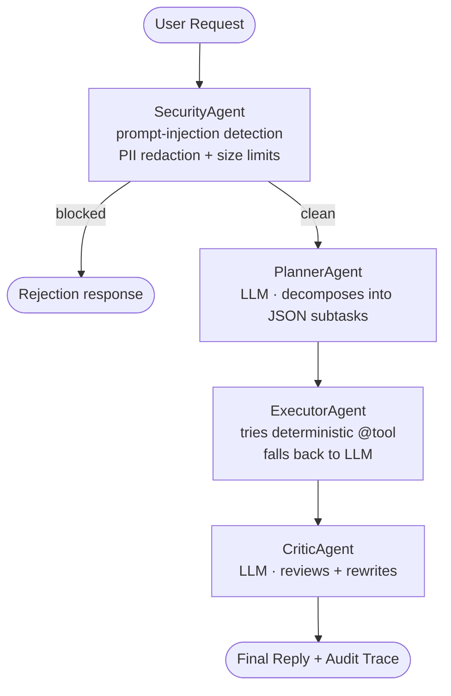

# IntentFlow — Multi-Agent System

A four-agent system built on FastAPI that accepts a natural-language request, decomposes it, executes it safely, and validates the result before replying. Security guardrails, deterministic tool calls, and LLM reasoning are all composed through an explicit pipeline — no agent framework required.

Submitted for the Wipro Junior FDE pre-screening assignment, April 2026.

## Architecture



Agents run sequentially. Every agent's output is appended to a structured `trace` returned alongside the reply, so every decision is inspectable. No agent calls another directly — all coordination runs through the orchestrator in `agents.run_multi_agent`.

## Quick start (Mac)

```bash
cd "/path/to/WIPRO PROJECT"
chmod +x run.sh
./run.sh
```

The script creates a virtualenv, installs dependencies, and starts the server. After it boots, open:

- **Chat demo (single-agent baseline):** http://localhost:8000/ui
- **API playground:** http://localhost:8000/docs
- **Multi-agent endpoint:** `POST http://localhost:8000/agent`

**Required environment:** a `.env` file in the project root containing a Groq API key (free at https://console.groq.com/keys):

```
GROQ_API_KEY=gsk_...
```

## Try it

```bash
curl -X POST http://localhost:8000/agent \
  -H "Content-Type: application/json" \
  -d '{"message": "What is 25 times 40?"}'
```

Response (abbreviated):

```json
{
  "reply": "25 times 40 equals 1000",
  "trace": {
    "steps": [
      {"agent": "SecurityAgent", "ok": true, "reason": "clean"},
      {"agent": "PlannerAgent", "subtasks": [{"step": 1, "description": "Calculate 25 * 40"}]},
      {"agent": "ExecutorAgent", "executions": [...]},
      {"agent": "CriticAgent", "approved": true, "final_answer": "25 times 40 equals 1000"}
    ]
  }
}
```

## Files

| File | Role |
|---|---|
| `agents.py` | The four agents + sequential orchestrator + retry/logging helper |
| `main.py` | FastAPI app with `/agent` and `/chat` endpoints |
| `tools.py` | `@tool` decorator + deterministic tool implementations |
| `router.py` | Intent parser + keyword-scoring router (used by Executor) |
| `intents/intents.md` | Human-readable intent config |
| `static/index.html` | Single-agent chat UI (baseline) |
| `tests/test_agents.py` | Unit tests (SecurityAgent) + integration tests (full pipeline) |
| `REPORT.md` | 1–2 page written report covering architecture, security, implementation, LLM use |
| `SAMPLE_PROMPTS.md` | Representative queries that exercise each path through the pipeline |

## Design decisions

**Sequential pipeline over agent graph.** Agents cannot call each other directly — all coordination runs through the orchestrator. This costs flexibility but makes security review tractable.

**Deterministic tools before LLM.** The Executor prefers a `@tool` match over LLM reasoning; this is cheaper, faster, and easier to test. LLMs handle the ambiguous cases — planning and critique.

**No framework dependency.** The orchestration layer is plain Python. No LangChain, no AutoGen, no CrewAI. Every agent boundary is visible in a single `agents.py` file.

**Safety gates are deterministic.** The SecurityAgent uses regex, not an LLM. Probabilistic systems should not be trusted to enforce safety.

**Full audit trace.** Every request returns the complete agent trace alongside the reply — nothing is hidden from the caller or the operator.
